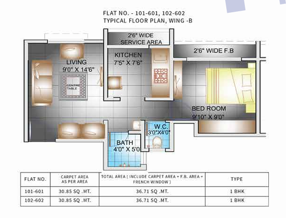

# Radheshyam Royal Website

Production-ready React + Vite website for the Radheshyam Royal residential project.

## Highlights

- Modern multi-page project website for real-estate marketing
- Fast, SEO-friendly frontend built on Vite + React
- Dedicated pages for about, amenities, floor plans, gallery, and contact
- Contact enquiry form integrated with EmailJS
- Mobile-friendly and optimized static asset structure

## Overview

This project is a multi-page marketing website with:

- Project details and highlights
- Amenities and floor-plan presentation
- Gallery and video sections
- Contact form integrated with EmailJS
- SEO-ready page metadata

## Screenshots

### Hero / Campaign Banner


### Main Building View


### Exterior Perspective


### Sample Floor Plan



## Tech Stack

- React 19
- Vite 7
- Tailwind CSS 4
- React Router 7
- EmailJS Browser SDK

## Getting Started

### Prerequisites

- Node.js 18+
- npm 9+

### Install

```bash
cd client
npm install
```

### Run Development Server

```bash
npm run dev
```

### Build Production Bundle

```bash
npm run build
```

### Preview Production Build

```bash
npm run preview
```

### Lint

```bash
npm run lint
```

## Environment Variables

The contact form in `src/components/Contact.jsx` requires EmailJS values in `.env`:

```env
VITE_EMAILJS_SERVICE_ID=your_service_id
VITE_EMAILJS_TEMPLATE_ID=your_template_id
VITE_EMAILJS_PUBLIC_KEY=your_public_key
```

Without these values, the form cannot send enquiries.

## Routes

Routes are defined in `src/routes/index.jsx`.

- `/` -> Home page
- `/about` -> About page
- `/amenities` -> Amenities page
- `/floor-plans` -> Floor plans page
- `/gallery` -> Gallery page
- `/contact` -> Contact page
- `/terms` -> Terms page
- `/privacy` -> Privacy page
- `/home-single` -> Single-page variant
- `*` -> 404 page

## Project Structure

```text
client/
  public/
    flat-layout/
    interview-video/
    sample-flat-videos/
    Logo.jpeg
    RERA-QR-code.jpeg
    robots.txt
    sitemap.xml
  src/
    components/
    pages/
    routes/
    App.jsx
    main.jsx
  index.html
  package.json
  vite.config.js
```

## Asset Notes

- Navbar logo currently references `public/Logo.jpeg`.
- Floor-plan visuals are expected in `public/flat-layout/`.
- Video-related media is expected in `public/interview-video/` and `public/sample-flat-videos/`.

## Deployment

This project includes `vercel.json` and can be deployed on Vercel directly.

Generic static deployment flow:

1. Run `npm run build`
2. Deploy the generated `dist/` folder

## Contact

- Website: `https://your-domain.example`
- Phone: `+91 XXXXX XXXXX`
- Email: `contact@example.com`
